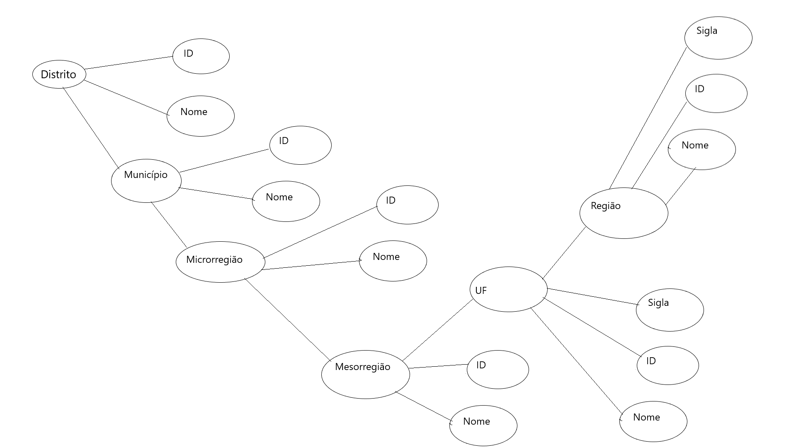

# Lab 01

Lab apresentado no dia 18 de setembro de 2020 com entrega para 25 de setembro de 2020

Tarefa consiste em importar duas bases de dados em formatos diferentes usando o Python e criar um diagrama que represente uma das bases de dados.

## Tarefa 1 

  [Notebook](notebooks/data-api-python.ipynb)
  
## Tarefa 2

  
